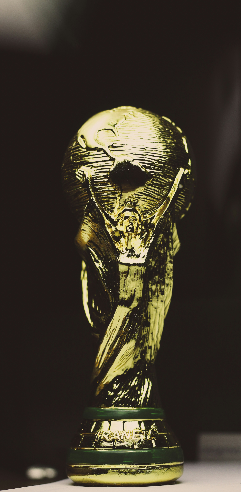

# 2014 FIFA World Cup Analysis

The 2014 FIFA World Cup, held in Brazil, united 32 nations in an unforgettable tournament featuring 64 matches across 12 host cities. 
This project uses data modeling, analysis, and visualization to uncover trends and insights about the tournament.

---

## 📊 **Project Overview**

This analysis has been done using Power BI which explores the 2014 FIFA World Cup dataset by 
- Performing DAX calculations
- Creating new data models, and establishing relationships between tables.
- Interactive visualizations of match trends, player statistics, and team performances.
- Filters for analyzing specific teams, players, or stadium performances.

---

## 📂 **Dataset**
The dataset used in this project was provided by my university which includes detailed information about the 2014 FIFA World Cup, featuring:
- **Matches**: Match details such as dates, host cities, scores, and stadiums.
- **Players**: Player details including age, club affiliations, positions, and international appearances.
- **Goals and Assists**: Goals scored, assists made, and players' contributions to their teams.
- **Cards**: Yellow and red cards received, fouls committed, and disciplinary records.

---

## 🛠️ **Features**
1. **Performed DAX Calculations**:
   - Created measures like total goals and average goals per match.
   - Calculated advanced statistics like goal/assist points, foul points and age of the players.

2. **New Tables**:
   - **Goals per Nation**: Summarized a new table having each country with the number of goals scored.
   - **Players with a goal**: Summarised players who have scored atleast one goal in the tournament.

4. **New Columns**:
   - Age category: Grouped players into senior, experienced, young and teen.
   - Week: Categorized the tournament based on week cycle.
   - Match Time Slot: Grouped match timings into afternoon, evening and night.

5. **Data Modeling**:
   - Established relationships between Country, Match_Results, Players, and Goals/Assist/Cards.
   - Linked new table with the existing table

---

## 🚀 **Key Insights**

- A total of 171 goals were scored by 32 nations across 64 matches, averaging 3 goals per match.
- James Rodríguez from Colombia was named the tournament's most valuable player by scoring 6 goals and making 2 assists.
- Germany scored the most goals (18) and won the tournament, defeating Argentina in the final.
- Arena Fonte Nova in Salvador witnessed the highest number of goals (24) in the tournament.
- A total of 185 yellow cards and 10 red cards were issued during the tournament.

For a detailed list of insights, refer to the [Insights document](./Insights.md).

---

## 📌 **Recommendations**

- Midfielders were key contributors in the tournament. Teams should invest in training versatile midfielders who can influence both attack and defense.
- A mix of experienced players (26–35 years old) and younger talents ensures strategic depth, leadership, and energy, which are critical for success in high-pressure matches.
- With 185 yellow cards and 10 red cards issued, teams should focus on improving defensive discipline to minimize fouls while maintaining competitive performance.
- Since most matches were played between 1 PM and 5 PM, teams should tailor training sessions to match these conditions, focusing on heat management and maintaining stamina.

For a detailed list of recommendations, refer to the [Recommendations document](./Recommendations.md).
